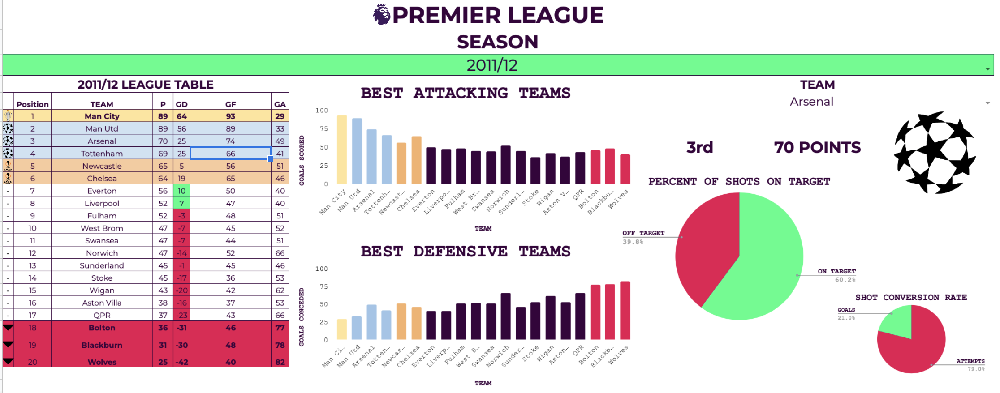

# Premier-League-Insights
A project that provides insights on premier league data using match day stats.

* Summarised Matchday stats into league tables using SQL.
* Provided season and team specific insights.
* Generated Analytical charts visualising how teams performed on both the attack and defence and each team goal conversion rate. 
* Technologies used: MySQL, Google Sheets

  

link to the dashboard: Xhttps://docs.google.com/spreadsheets/d/14VhhZegyzWsv0lCURQityHidiw9ew-L4aySuonY2P9I/edit?usp=sharing
